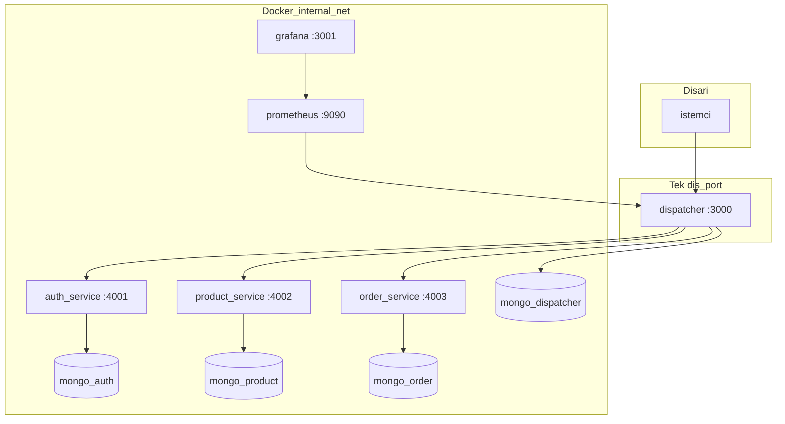

# campus-commerce-ms

Kampus e-ticaret senaryosu için mikroservis mimarisi: tek giriş noktası **Dispatcher (API Gateway)**, merkezi yetkilendirme ve trafik gözlemi; arka planda **auth**, **product** ve **order** servisleri. Her servisin ayrı **MongoDB** veri tabanı vardır; dış dünyaya yalnızca Dispatcher portu açıktır.

## Ekip ve teslim

| | |
| --- | --- |
| Proje adı | campus-commerce-ms |
| Ekip üyeleri | *(isimleri buraya ekleyin)* |
| Son güncelleme | Nisan 2026 |

## Mimari (Mermaid)

**Ağ izolasyonu:** `docker-compose` içinde yalnızca `dispatcher`, `prometheus` ve `grafana` için `ports` tanımlıdır. Mikroservisler `expose` ile iç ağda kalır; host üzerinden doğrudan erişim yoktur (PDF’de istenen network isolation).

