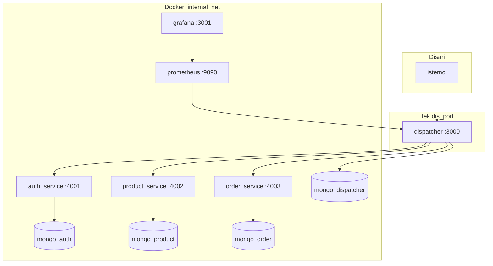

# campus-commerce-ms

Kampus e-ticaret senaryosu için mikroservis mimarisi: tek giriş noktası **Dispatcher (API Gateway)**, merkezi yetkilendirme ve trafik gözlemi; arka planda **auth**, **product** ve **order** servisleri. Her servisin ayrı **MongoDB** veri tabanı vardır; dış dünyaya yalnızca Dispatcher portu açıktır.

## Ekip ve teslim

| | |
| --- | --- |
| Proje adı | campus-commerce-ms |
| Ekip üyeleri | *(isimleri buraya ekleyin)* |
| Son güncelleme | Nisan 2026 |

## Mimari (Mermaid)



**Ağ izolasyonu:** `docker-compose` içinde yalnızca `dispatcher`, `prometheus` ve `grafana` için `ports` tanımlıdır. Mikroservisler `expose` ile iç ağda kalır; host üzerinden doğrudan erişim yoktur (PDF’de istenen network isolation).

## Öğrenme çıktılarına uyum (özet)

- **Dispatcher TDD:** `dispatcher` içinde Jest + Supertest ile gateway davranışı test edilir; geliştirme sırasında testlerin üretim kodundan önce yazılması beklenir (Red–Green–Refactor).
- **HTTP durum kodları:** Hatalarda gerçekçi 4xx/5xx; upstream erişilemezse `502 Bad Gateway`.
- **Yetki:** Bearer token doğrulaması Dispatcher’daki MongoDB üzerinden; mikroservisler yalnızca iç ağdan çağrılır.
- **Gözlem:** Prometheus metrikleri (`/metrics`), Grafana’da Explore ile sorgulama; Dispatcher üzerinde **metin tablolu** trafik günlüğü: JSON `GET /gateway/admin/logs` veya tarayıcı için `GET /gateway/admin/logs-ui?token=...`.

## Çalıştırma

Önkoşul: Docker + Docker Compose.

```bash
docker compose up --build
```

- **API (Dispatcher):** http://localhost:3000  
- **Prometheus:** http://localhost:9090  
- **Grafana:** http://localhost:3001 — varsayılan giriş `admin` / `admin`  
- Veri kaynağı: Grafana’da **Prometheus** hazır; Explore’da örnek metrik: `dispatcher_http_requests_total`

**Trafik günlüğü (tablo):**

- JSON: `GET http://localhost:3000/gateway/admin/logs` — başlık `x-admin-token: <token>`
- HTML: `GET http://localhost:3000/gateway/admin/logs-ui?token=<token>`  
- Varsayılan token (geliştirme): `dev-admin-token` — üretimde `ADMIN_LOG_TOKEN` ortam değişkeni ile değiştirin.

## Yük testi

PDF; **JMeter, Locust veya k6** kabul ediyor. En rahat kullanım: **Locust Web UI** (kullanıcı sayısını ve süreyi tarayıcıdan seçersiniz).

### Locust (Web arayüzü — önerilen)

Stack’i ayağa kaldır (`docker compose up --build`). **Locust** servisi ile birlikte gelir; tarayıcıda aç:

**http://localhost:8089**

1. **Start** öncesi: **Number of users** (ör. 50, 100, 200, 500) ve **Spawn rate** (saniyede kaç kullanıcı ekleneceği) girin.  
2. **Host** alanı Docker ile otomatik `http://dispatcher:3000` olur (Compose içinden).  
3. **Start swarming** → grafik ve tablolardan ortalama süre, RPS, hata oranını alın; rapora tablo + ekran görüntüsü koyun.

Yerel Python ile (Docker’sız Locust çalıştırmak istersen):

```bash
python3 -m venv .venv
source .venv/bin/activate
pip install -r load-tests/requirements-locust.txt
locust -f load-tests/locustfile.py --host http://localhost:3000
```

Sonra yine **http://localhost:8089** adresine gidin.

### k6 (komut satırı)

[k6](https://k6.io/) kurulu iken (`brew install k6`):

```bash
k6 run load-tests/smoke.js
```

`load-tests/smoke.js` içindeki `stages` ile 50 / 100 / 200 / 500 senaryolarını ayarlayıp tekrarlayabilirsiniz.

