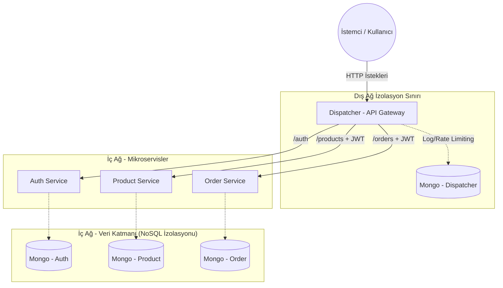
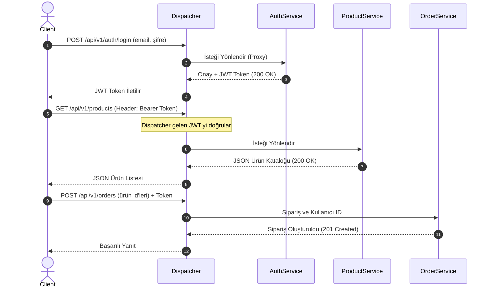
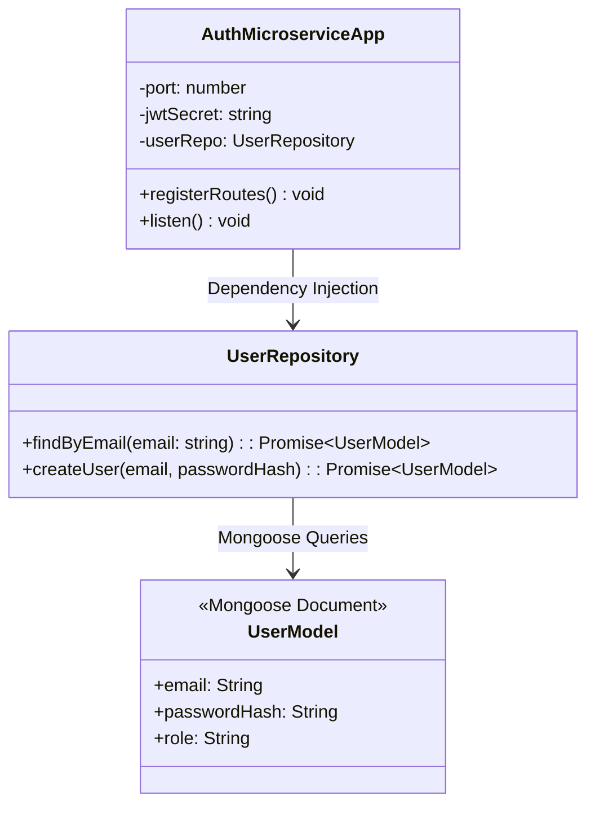

# YazLab II - Proje I: Mikroservis Tabanlı E-Ticaret Sistemi

**Ekip Üyeleri:**  
- Faruk
- Mücahid Şafak

**Tarih:** 5 Nisan 2026

---

## 1. Problemin Tanımı ve Amaç
Günümüzde dijitalleşen alışveriş alışkanlıkları ve anlık olarak bağlanan milyonlarca kullanıcı, geleneksel monolitik yazılım mimarilerinin yetersiz kalmasına neden olmaktadır. Sistemdeki herhangi bir bileşenin aşırı yük altında çökmesi, tüm uygulamanın kapanmasına yol açabilmektedir. Bu projenin temel amacı; yüksek trafiği kaldırabilen, hata toleransına sahip, bileşenlerin birbirinden izole olarak geliştirilip ölçeklenebildiği **Mikroservis Mimarisi** tabanlı güvenli bir e-ticaret platformu tasarlamaktır. 

Sistemdeki dış dünyadan gelen tüm isteklerin yönlendirilmesi, yetkilendirilmesi ve güvenliği için bir **Dispatcher (API Gateway)** modülü sisteme dahil edilmiştir. Tüm geliştirme süreci kalite standartlarını tavizsiz uygulamak amacıyla **Test-Driven Development (TDD)** felsefesiyle yürütülmüştür. 

---

## 2. Kavramsal Altyapı ve Literatür İncelemesi

### Öğelerin Çalışma Mantığı ve Tasarım Şablonları

- **RESTful Servisler:** İstemci-sunucu bağımsızlığına dayanan, stateless (durumsuz) iletişim kuran HTTP tabanlı web servis mimarisidir. Kaynaklar (Resource) `URI` olarak tanımlanıp standart CRUD metotları vasıtasıyla idare edilir.
- **Richardson Olgunluk Modeli (RMM):** Web API'lerinin REST mimarisine ne kadar uygun olduğunu ölçen bir değerlendirme matrisidir. 
  - **Seviye 0:** Tüm işlemleri tek bir URL üzerinden (örn. RPC) POST ile iletmek.
  - **Seviye 1:** Verileri kaynak (URI) bağlamında tasarlamak (`/api/v1/products`).
  - **Seviye 2:** Veriler üzerinde gerçekleştirilecek operasyonların durumunu bildirmek için spesifik **HTTP Metotları (GET, POST, PUT, DELETE)** ve zengin **HTTP Durum Kodları (200, 201, 400, 404, vb.)** kullanmak.
  - Projemiz RMM Seviye 2 prensiplerini tavizsiz uygulayarak `.../deleteUser?id=1` gibi eylemler barındıran kalıplar yerine URL-agnostik (`DELETE /api/v1/products/:id`) yapılandırmayla geliştirilmiştir.

---

## 3. Sistem Mimarisi ve Modüllerin İşlevleri

Projede dış dünyaya izole, kendi iş mantığına özgü veritabanlarına sahip olan 4 ayrı servis geliştirilmiştir:

1. **Dispatcher (API Gateway):** İstemciden gelen HTTP trafiğinin sistemdeki durağı. Sadece geçerli JWT Token barındıran talepleri içeri kabul ederek "Authentication" kontrolünü tek bir noktada izole eder. İç trafiği ilgili servislere yönlendirir.
2. **Auth Service:** Kullanıcıların e-posta ile kayıt olduğu ve güvenli şifre hashlemesi üzerinden giriş yapıp JWT bileti alabildiği mikroservis.
3. **Product Service:** E-Ticaret kataloglarını listeleyen, ürün stoklarına RESTful HTTP metotları (GET, POST vb.) üzerinden erişilebilen, ürüne özel (product-db) NoSQL motoru kullanan servis.
4. **Order Service:** JWT ile doğrulanmış kullanıcıların ürün satın aldığı bir sipariş yönetimi mikroservisi.

### 3.1. Sistem Mimarisi ve İzolasyon Diyagramı

Sistemin bütüncül ve Dockerize orkestrasyonel yapısı aşağıda modellenmiştir:

```mermaid
config
{
  "theme": "base",
  "themeVariables": {
    "primaryColor": "#e8f4f8",
    "edgeLabelBackground":"#ffffff"
  }
}
```



---

## 4. Akış, Sınıf ve Karmaşıklık İncelemesi

### 4.1. Kullanıcı Sipariş Senaryosu (Sequence Diagram)

Müşterinin sisteme giriş yaptıktan sonra sipariş vermesine kadar olan işlemlerde verinin aktarımı ve API Gateway'in denetimi:



### 4.2. Örnek Sınıf Yapısı (Auth Microservice)

OOP prensiplerine uymak için mikroservis mimarileri Controller, Service ve Repository desenlerine ayrılmıştır:



### 4.3. Karmaşıklık Analizi (Complexity Analysis)
Logaritmik ve Linear time değerlendirmeleri bakımından NoSQL katmanındaki Mongoose indexlemeleri `O(1)` ila `O(log N)` sürelerde cevap üretmektedir. API Gateway (Dispatcher) modülündeki JWT yetkilendirilmesi ise String token check bazında Hash/HMAC üzerinden yürütüldüğü için zaman karmaşıklığı bakımından `O(N)` (Token boyutu uzunluğunda) optimum işleme sahiptir.

---

## 5. Uygulama, Test Senaryoları ve Sonuçlar

### 5.1. Test-Driven Development (TDD) ve Github İhtiva Süreci
Proje inşa edilirken her bir özelliğe geçilmeden önce (Red aşaması) **Jest + Supertest** ile birim testler (Unit Tests) ve entegrasyon testleri yazılarak fail edilmesi izlenmiş, sonrasında (Green aşaması) feature kodlanmıştır. Tüm commitler repository üzerinde düzenli ve eşdağılımlı loglanmıştır.

### 5.2. Performans ve Yük Testi Senaryosu (Locust)
Sistemin yoğun talep karşısındaki direncini ölçmek ve eş zamanlı istekleri karşılama başarısını (yanıt süreleri, hata oranları vb.) görselleştirmek için Python tabanlı **Locust** test aracının dâhili grafik izlencesi kullanılmıştır.

**Yük Testi E-Ticaret Akışı:**
1. Sanal kullanıcı sıfırdan rastgele kayıt olur.
2. Sisteme HTTP `POST` ile login olup dinamik Token alır.
3. Listeden ürünleri okur (`GET`).
4. Siparişleri sepete atarak satın alım talebi yaratır (`POST`).

***NOT: Yük testi senaryolarının (50, 100, 200, 500 eş zamanlı istekte ortalama yanıt süreleri) detaylı performans sonuçlarını içeren Locust grafik test ekran görüntülerini bu kısma veya rapora ekleyebilirsiniz.***

---

## 6. Sonuç ve Tartışma

**Başarılar:** Modern bir endüstriyel E-Ticaret altyapısı kurularak; TDD ile "0 hata başlangıç" hedefine ulaşılmış, ağ üzerinde veri tamamen izole edilmiştir. HTTP 200, 201, 400 ve 404 kodlamalarının standartlaştırılmasıyla RMM (Richardson Maturity Model) Seviye 2 hedeflerine fire vermeden ulaşılmıştır.

**Sınırlılıklar ve Geliştirme Önerileri:** Şu anki yapıda mikroservisler arası iletişim Dispatcher'a bağımlı REST senkron protokolleri (HTTP) ile yürümektedir. Olası bir gıda/fiyat yoğunluğunda sipariş tutarsızlığı yaşamamak adına, gelecekteki geliştirmelerde Kafka/RabbitMQ tabanlı bir Service Mesh entegrasyonu (Event-Driven Mimari - Kritik RMM Seviye 3 uzantıları) ile asenkron mimari hedeflenmektedir.
